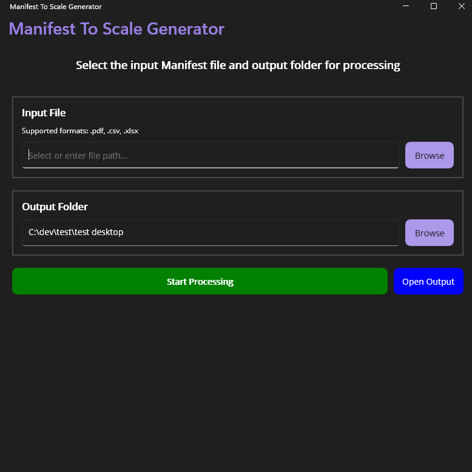
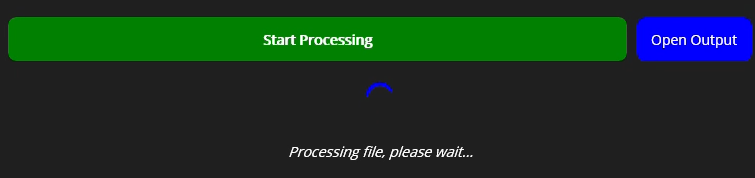

# Manifest To Scale - User Guide

## Table of Contents
1. [Getting Started](#getting-started)
2. [Application Overview](#application-overview)
3. [Processing Your First File](#processing-your-first-file)
4. [Understanding File Types](#understanding-file-types)
5. [Working with Output Files](#working-with-output-files)
6. [Advanced Features](#advanced-features)
7. [Troubleshooting](#troubleshooting)
8. [Tips and Best Practices](#tips-and-best-practices)

---

## Getting Started

### System Requirements
- Windows 10 or Windows 11
- Minimum 4GB RAM
- 500MB free disk space

### Installation
1. Download the latest release of Manifest To Scale
2. Extract the files to your preferred location
3. Run `ManifestToScale.bat` to start the application

**Application release extracted files:**


---

## Application Overview

When you first launch Manifest To Scale, you'll see the main update application interface that will check and download any updates to the application.

**Updater application window:**


If no updates are found, an update fails, or an update is completed successfully, 
the main application will be launched automatically with several key areas:

**Main application window:**



### Main Interface Elements

1. **Header Section**: Displays the application title and instructions
2. **Input File Section**: Where you select your manifest file to process
3. **Output Folder Section**: Where you choose where processed files will be saved
4. **Processing Controls**: Start processing and open output folder buttons
5. **Progress Area**: Shows processing status and progress bar
6. **Output Log**: Displays detailed information about the processing results

**Main interface with sections highlighted:**


---

## Processing Your First File

### Step 1: Select an Input File

1. In the **Input File** section, click the **Browse** button
2. Navigate to your manifest file
3. Select a PDF, CSV, or XLSX file
4. Click **Open**

**Screenshot: File selection dialog**
*[Insert screenshot of the file picker dialog]*

The selected file path will appear in the input field:

**Input field with selected file:**


### Step 2: Choose the Output Folder

1. In the **Output Folder** section, click the **Browse** button
2. Navigate to where you want your processed files saved
3. Select your desired folder
4. Click **Select Folder**

**Note:** The output folder path will be remembered for future uses.

**Folder selection dialog:**


### Step 3: Start Processing

1. Click the **Start Processing** button
2. Watch the progress bar and status messages
3. Review the detailed output log

**Processing in progress:**



### Step 4: Processing Complete

When processing is finished, you'll see a success message and detailed results:

**Successful processing completion:**


**Successful processing output logs:**


---

## Understanding File Types

### PDF Files (Fresh To Go Manifests)

PDF files are processed through the Fresh To Go workflow:

- **Input**: PDF manifest documents
- **Processing**: Text extraction and data parsing
- **Output**: Simplified PDF **(single page PDF)**, Text files **(txt/cleaned txt)** Excel file **(xlsx)**, Comma Separated Value file **(CSV)**, and a subfolder for Scale XML files **(rcxml/shxml)**

**PDF processing results:**


### CSV/XLSX Files (Azura Fresh Manifests)

CSV and Excel files are processed through the Azura Fresh workflow:

- **Input**: CSV or XLSX data files
- **Processing**: Direct data parsing and validation
- **Output**: Scale XML files **(rcxml/shxml)**

**CSV/XLSX processing results**


---

## Working with Output Files

### Understanding the Output Structure

After processing, your output folder will contain a uniquely named job folder:

```
Output Folder/
└── {Job-GUID}/
    ├── scale_interface_files/
    │   ├── Receipt XML file
    │   └── Shipment XML file
    └── Additional files (PDF processing only)
```
**PDF processing output files:**


**Scale interface files generated from PDF:**


**CSV/XLSX processing results**


### Opening Output Files

1. Click the **Open Output** button to open the job folder directly
2. Navigate to the `scale_interface_files` folder for XML files
3. The XML files are ready for import into Scale's interface/input folder

### File Naming Convention

Files are named with specific patterns:
- **Receipt XML**: `{Company}_Receipt-{Date}.rcxml`
- **Shipment XML**: `{Company}_Shipments-{Date}.shxml`

### Example File Names
- Fresh to Go Receipt XML: `PER-CO-FTG_Receipt-09-07-2025.rcxml`
- Fresh to Go Shipment XML: `PER-CO-FTG_Shipments-09-07-2025.shxml`


- Azura Fresh Receipt XML: `PER-CO-CAF_Receipt-09-07-2025.rcxml`
- Azura Fresh Shipment XML: `PER-CO-CAF_Shipments-09-07-2025.shxml`

---

## Advanced Features

### Settings Persistence

The application automatically remembers:
- Your last used output folder
- Recent input file locations
- Window size and position

### Processing Status Information

The output log provides detailed information including:
- File processing steps
- Manifest statistics (orders, crates, dates)
- Processing time
- Success/error status

### Error Handling

If processing encounters issues, an error is noted in the output log:

**Error message display:**


### Log Files

All processing logs are saved in the output folder under `logs/` with datestamps:

**Log output folder:**


Each log file contains the output from the application and more detailed error messages if any issues occurred during processing.

**Log file example:**


---

## Troubleshooting

### Common Issues and Solutions

#### "Please select an input file" Error
**Problem**: You clicked Start Processing without selecting a file
**Solution**: Use the Browse button to select an input file first

**Please select an input file error message:**


#### Processing Fails
**Problem**: The manifest file cannot be processed
**Solution**: Check the output log for specific error details

**Processing failure with error details:**


### File Format Issues

#### Unsupported File Types
Only PDF, CSV, and XLSX files are supported. Other formats will cause errors.

**Unsupported file type error:**


---

## Tips and Best Practices

### File Organization
- Create dedicated folders for input and output files
- Use descriptive folder names with dates
- Keep original files as backups

### Regular Processing
- Process files promptly after receiving them
- Check output logs for any warnings or issues
- Verify XML files before importing to Scale

### Performance Tips
- Use local drives rather than network drives for input and output when possible

### Backup Considerations
- Keep copies of original manifest files
- Back up processed XML files before importing
- Save processing logs for audit trails

---

## Getting Help

If you encounter issues not covered in this guide:

1. Check the output log for detailed error information
2. Verify your input file format and content
3. Ensure you have write permissions to the output folder
4. Contact your Bryce Standley for technical support


---

*Last updated: 09/07/2025*
*Version: 1.2.2*